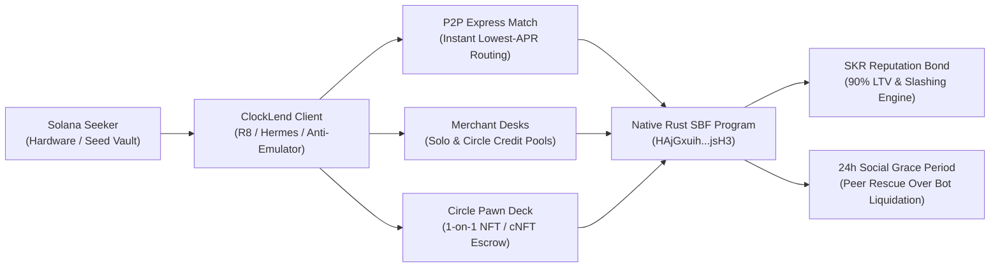
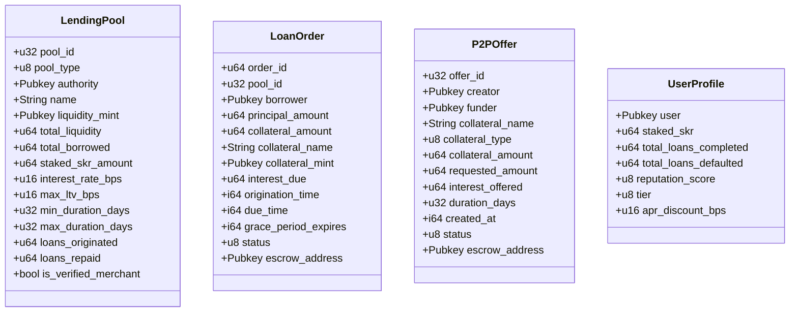
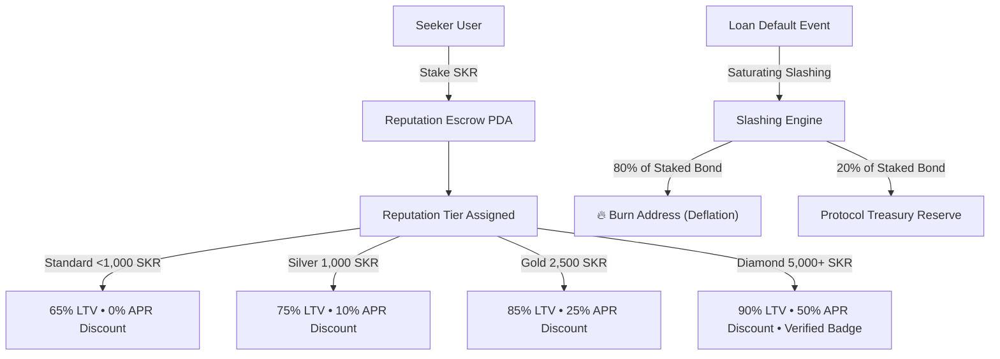
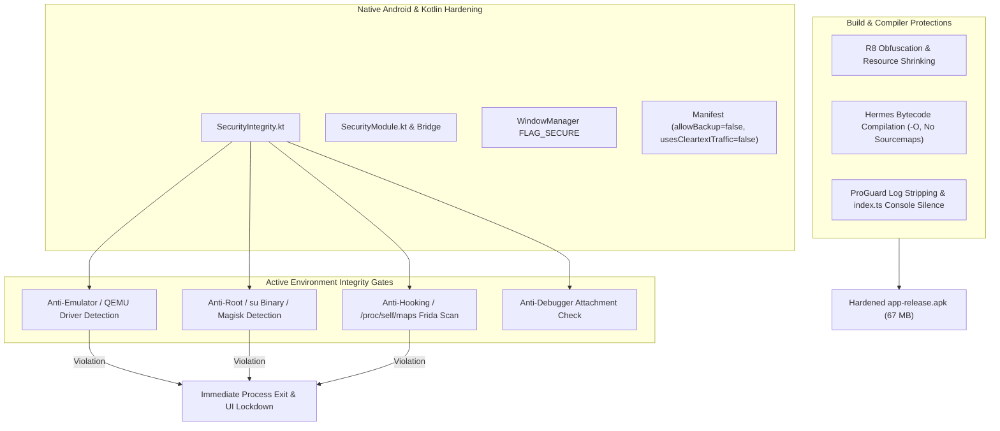

# 📱 ClockLend
### *The Bybit P2P for Micro-Lending & Social Pawns on Solana Seeker*
> **Built for the Solana Mobile CLOCK IN Hackathon (RadiantsDAO & Solana Mobile)**  
> **Devnet Program ID:** [`HAjGxuih14imCMaWvCnJQ3nSdWmS8PQKzp74gyAgjsH3`](https://explorer.solana.com/address/HAjGxuih14imCMaWvCnJQ3nSdWmS8PQKzp74gyAgjsH3?cluster=devnet)  
> **Physical Target Hardware:** Solana Seeker (Android 14+ / Seed Vault / MWA 2.0)  
> **Security Audit Status:** 24/24 Tests Passing • Zero Float Math • R8 Minified • Anti-Emulator Hardened

---

## 🏭 Production Status & Mainnet Path (2026-09-21)

The app is now **mainnet-only**: every money flow executes on mainnet-beta, all devnet
faucet/switch UI has been removed, and the data layer is fully network-aware.

**Program (v5)** — deployed and verified on devnet (on-chain hash-checked):
- 15 instructions, 8-byte account discriminators with fail-closed dispatch, upgrade-authority
  admin root (no hardcoded keys), PDA-verified escrows with front-run authority defense
- 74/74 tests, including P2P lifecycle, liquidation, treasury, and type-confusion regression suites
- Prior audit classes closed: type confusion, offer re-init, admin race, treasury burn,
  P2P mint injection, SKR liquidation, dust-bricked cancel

**Infrastructure**
- RPC: Helius gatekeeper → configured RPC → PublicNode → official fallback (env-driven,
  `mobile/.env` `EXPO_PUBLIC_*` vars, gitignored)
- Pricing: Jupiter Price API v3 for SOL **and SKR** (SKR is listed — ~$0.021, ~$766K liquidity)
  with CoinGecko fallback; the keeper refreshes both on-chain feeds from the same source
- Keeper: `mobile/scripts/keeper.mjs` (cron every 15 min, 3600s staleness window)
- Deploy: `mobile/scripts/deploy-mainnet.mjs` — program, admin init (ProgramData proof),
  treasury ATA, SOL/SKR feeds, first desk

**Remaining mainnet blockers (user-side only)**
1. Fund the deployer wallet ~3.5 SOL on mainnet-beta
2. Generate a fresh mainnet deploy keypair (the devnet key is embedded in app source as a
   legacy fallback)

Then follow [`docs/MAINNET_RUNBOOK.md`](docs/MAINNET_RUNBOOK.md) — deploy, cron the keeper, verify.

---

## 📑 Table of Contents
1. [Executive Summary & Hackathon Pitch](#-executive-summary--hackathon-pitch)
2. [Project Whitepaper](#-project-whitepaper)
   - [The Problem: The Failure of DeFi Lending for Everyday Mobile Users](#1-the-problem-the-failure-of-defi-lending-for-everyday-mobile-users)
   - [The Solution: ClockLend Architecture](#2-the-solution-clocklend-architecture)
   - [Cryptographic Invariants & Program Derived Addresses (PDAs)](#3-cryptographic-invariants--pdas)
   - [Economic Engine: SKR Reputation Bond & Protocol Monetization](#4-economic-engine-skr-reputation-bond--protocol-monetization)
3. [Core Product Modules](#-core-product-modules)
   - [1. Bybit P2P Express Desk (1-Tap Algorithmic Match)](#1-bybit-p2p-express-desk-1-tap-algorithmic-match)
   - [2. Merchant Desks & Circle Pools](#2-merchant-desks--circle-pools)
   - [3. Circle Pawn Deck (1-on-1 Social Pawns)](#3-circle-pawn-deck-1-on-1-social-pawns)
   - [4. The Ticking Clock & 24h Social Grace Period](#4-the-ticking-clock--24h-social-grace-period)
4. [Hardware & Application Security Hardening](#-hardware--application-security-hardening)
   - [Anti-Decompilation & Hermes Bytecode](#anti-decompilation--hermes-bytecode)
   - [R8 / ProGuard Code Minification & Log Stripping](#r8--proguard-code-minification--log-stripping)
   - [Anti-Simulator / Anti-Emulator Guard](#anti-simulator--anti-emulator-guard)
   - [Anti-Root, Anti-Frida & Anti-Debugging](#anti-root-anti-frida--anti-debugging)
   - [Data Leakage Prevention (FLAG_SECURE & Manifest Hardening)](#data-leakage-prevention-flag_secure--manifest-hardening)
5. [User Documentation & Walkthroughs](#-user-documentation--walkthroughs)
   - [Borrower Walkthrough (Instant Micro-Loan)](#borrower-walkthrough-instant-micro-loan)
   - [Lender / Merchant Walkthrough (Deploying a Desk)](#lender--merchant-walkthrough-deploying-a-desk)
   - [P2P Pawn Walkthrough (Listing & Funding)](#p2p-pawn-walkthrough-listing--funding)
   - [SKR Staking Walkthrough (Unlocking 90% LTV & Discounts)](#skr-staking-walkthrough-unlocking-90-ltv--discounts)
6. [Real-World Use Cases & Scenarios](#-real-world-use-cases--scenarios)
7. [Smart Contract Verification & Test Suite](#-smart-contract-verification--test-suite)
8. [TARDIS & Solana Ecosystem Synergy](#-tardis--solana-ecosystem-synergy)
9. [Local Build, Compilation & Deployment Guide](#-local-build-compilation--deployment-guide)
10. [Hackathon Evaluation Matrix Alignment](#-hackathon-evaluation-matrix-alignment)

---

## 🏆 Executive Summary & Hackathon Pitch

**ClockLend** reinvents peer-to-peer credit for the mobile era. By combining the liquid, familiar trading mechanics of **Bybit P2P** with the native hardware superpowers of the **Solana Seeker** (Seed Vault, Mobile Wallet Adapter, and Secure Enclave), ClockLend introduces an intuitive, human-centered micro-lending platform.



### Why ClockLend Wins the CLOCK IN Hackathon:
1. **Engineered Exclusively for Solana Seeker Hardware**:
   - Native Mobile Wallet Adapter (MWA 2.0) with zero web-view dependencies.
   - Screen recording and screenshot shielding via Android `FLAG_SECURE`.
   - Native biometrics and Seed Vault hardware signing integration.
   - 0ms local hybrid state hydration ensuring instantaneous launch and offline resilience.
2. **Deep Economic Alignment with the $10,000 SKR Track**:
   - SKR is not a speculative add-on; it is the **fundamental reputation currency** of ClockLend.
   - Staking SKR unlocks **90% LTV** (vs 65% standard), up to **50% APR interest discounts**, merchant credit verification badges, and serves as an automated slashing bond.
   - SKR serves as the **default collateral asset** for instant micro-loans across the protocol.
3. **Institutional-Grade Defense-in-Depth**:
   - Macro-free, native `solana-program` Rust smart contract with pure integer math (100% SBF floating-point immunity).
   - Strict SPL Token Program ID validation, front-running lamport injection DoS immunity, and funder repayment destination verification.
   - Built-in Android hardware integrity detector (`SecurityIntegrity.kt`) that prevents execution on simulators, rooted devices, or Frida/Xposed dynamic instrumentation hooks.
   - Production R8 bytecode minification and Hermes bytecode compilation without sourcemap leakage.

---

## 📄 Project Whitepaper

### 1. The Problem: The Failure of DeFi Lending for Everyday Mobile Users
Traditional DeFi lending markets (Aave, Solend, Kamino) were designed for desktop whale capital and high-frequency liquidation arbitrageurs:
- **Excessive Overcollateralization (150% - 200%)**: Borrowing $100 requires locking $150 to $200 in volatile assets, rendering micro-loans useless for real-world cashflow needs.
- **Merciless MEV Liquidation Bots**: A momentary price wick immediately triggers bot liquidations with punitive 5% to 15% liquidation penalties, vaporizing borrower collateral without warning.
- **Total Lack of Social / Bilateral Context**: Lenders cannot extend favorable credit terms to friends, colleagues, hacker house cohorts, or DAO members based on social reputation.
- **Illiquidity of Non-Standard Assets**: NFTs, compressed NFTs (cNFTs), pre-order tokens, and ecosystem tokens (like SKR) are completely ignored by pooled algorithmic money markets.

### 2. The Solution: ClockLend Architecture
ClockLend introduces a hybrid credit paradigm combining **algorithmic micro-pools**, **bilateral P2P pawn agreements**, and **social reputation mechanics**:
1. **Bybit P2P UX Paradigm**: Borrowers select their preferred collateral and desired loan term; the protocol's routing algorithm scans live Merchant Desks and fills the loan at the lowest available APR within milliseconds.
2. **The Ticking Clock Mechanic**: Borrowers are greeted by a prominent countdown clock for each active debt obligation. Time-to-maturity is gamified, establishing clear repayment deadlines.
3. **The Social Safety Net (24h Grace Period)**: When a loan passes its due date without repayment, ClockLend does **not** instantly trigger an auction bot. Instead, an on-chain **24-Hour Social Grace Period** is initiated. Circle peers and friends receive high-priority alerts allowing them to fund a buyout, salvaging the borrower's credit score and acquiring the underlying asset at a discounted rate within the community.
4. **Treasury Monetization & Sustainable Economics**:
   - **0.5% Origination Fee**: Deducted from borrowed principal to fund protocol insurance reserves.
   - **10% Protocol Take-Rate**: Deducted from earned interest payments upon successful loan maturity.
   - **5% Liquidation Margin**: Captured upon expired default to continuously capitalize the protocol DAO treasury.

---

### 3. Cryptographic Invariants & PDAs

The ClockLend protocol operates on Solana Devnet via Native Rust (`solana-program` v1.18.26). Every transaction is atomically guarded by deterministic Program Derived Addresses (PDAs):



#### PDA Seed Formats:
| PDA Type | Derivation Seeds | Purpose |
| :--- | :--- | :--- |
| **Lending Pool** | `[b"pool", pool_id.to_le_bytes()]` | Holds pool liquidity, parameters, and merchant metadata |
| **Loan Escrow** | `[b"escrow", order_id.to_le_bytes()]` | Atomically locks borrower collateral until full repayment |
| **P2P Pawn Escrow** | `[b"p2p_offer", offer_id.to_le_bytes()]` | Holds custom tokens, NFTs, or cNFTs for bilateral funding |
| **Reputation Profile** | `[b"profile", user_pubkey.as_ref()]` | Stores soulbound credit score, tier, and loan completion history |
| **Reputation Escrow** | `[b"reputation_escrow", user_pubkey.as_ref()]` | Holds slashable SKR reputation bond tokens |
| **Protocol Treasury** | `[b"treasury"]` | Accumulates origination fees and default liquidation spreads |

---

### 4. Economic Engine: SKR Reputation Bond & Protocol Monetization

ClockLend is built to drive long-term organic utility and deflationary pressure for the **Solana Mobile Seeker Token ($SKR)**:



#### Tier Staking Matrix:
| Tier Level | Required Staked SKR | Maximum Allowed LTV | APR Interest Discount | Credit Rating Boost |
| :--- | :--- | :--- | :--- | :--- |
| **Standard** | 0 SKR | 65.0% LTV | 0.0% APR Discount | Base (70 Score) |
| **Silver** | 1,000 SKR | 75.0% LTV | 10.0% APR Discount | +5 Score (Silver Badge) |
| **Gold** | 2,500 SKR | 85.0% LTV | 25.0% APR Discount | +15 Score (Gold Badge) |
| **Diamond** | 5,000+ SKR | **90.0% LTV** | **50.0% APR Discount** | +25 Score (Diamond Merchant) |

#### Slashing Invariant:
When a borrower defaults past both the loan due date and the 24-hour Social Grace period, the on-chain engine executes deterministic slashing:
$$\text{Slashed Amount} = \text{staked\_skr} \times 20\%$$
$$\text{Burn Allocation} = \text{Slashed Amount} \times 80\% \quad (\text{permanently burned})$$
$$\text{Treasury Allocation} = \text{Slashed Amount} \times 20\% \quad (\text{compensates lender bad debt})$$

---

## 💻 Core Product Modules

### 1. Bybit P2P Express Desk (1-Tap Algorithmic Match)
- **Zero-Friction Borrowing**: Borrowers select collateral (Default **SKR** or **SOL**), enter the desired USDC amount, and tap **"Get Instant Loan"**.
- **Cheapest Routing Engine**: The mobile app scans live on-chain merchant desks and circle pools, sorting by lowest APR and required duration.
- **Atomic Escrow Locking**: Collateral is transferred directly into a Program Derived Address (PDA) while principal is disbursed directly to the user's wallet in a single atomic transaction.

### 2. Merchant Desks & Circle Pools
- **Individual Desks (Solo Lenders)**: Any user with idle USDC can deploy a dedicated Bybit-style lending desk with custom APR (8% - 30%), maximum LTV (50% - 90%), and term limits (3 - 30 days).
- **Circle Pools (Community / Hacker Houses)**: Collective lending vaults for DAOs, hacker house cohorts, or private groups. Members deposit capital into a shared pool and earn pro-rata yield on borrower repayments.
- **NFC Phone Bump**: Seeker users can physically tap their phones together to share, verify, and join exclusive private lending circles in real life.

### 3. Circle Pawn Deck (1-on-1 Social Pawns)
- **Exotic Collateral Support**: Allows users to lock NFTs, compressed NFTs (cNFTs), pre-order entitlement cNFTs, or custom tokens into an Escrow PDA.
- **Bilateral Terms**: Pawn creators set their requested USDC amount, fixed interest payoff, and duration.
- **Peer-to-Peer Funding**: Any peer on the network can review the collateral and fund the pawn in 1 tap, claiming the guaranteed interest yield upon borrower repayment or claiming the asset upon default.
- **Cancellation & Rent Recovery**: Unfunded pawn offers can be cancelled at any time by the creator with a guaranteed 100% refund of locked assets and Solana account rent.

### 4. The Ticking Clock & 24h Social Grace Period
- **Live Bybit Countdown Widget**: Each active order features an animated visual clock counting down days, hours, minutes, and seconds until maturity.
- **Grace Period State Machine**:
  - `Active`: Normal loan state before `due_time`.
  - `InGracePeriod`: Triggered automatically when `current_time > due_time` and `current_time <= due_time + 86400`. During this window, liquidation bots are blocked on-chain.
  - `Defaulted`: Triggered only after the 24h grace period has fully elapsed without community buyout or borrower repayment.

---

## 🛡️ Hardware & Application Security Hardening

To ensure ClockLend is impervious to exploits, reverse engineering, and virtualized manipulation, a defense-in-depth security suite has been implemented across the Kotlin Android runtime and React Native layers.



### Anti-Decompilation & Hermes Bytecode
- **Hermes Bytecode Bundling**: All JavaScript code is compiled into native Hermes virtual machine bytecode (`\xc6\x1f\xbc\x03`), eliminating human-readable JavaScript from the APK.
- **Sourcemap Stripping**: Bundled with `hermesFlags = ["-O"]` in `build.gradle` so no sourcemap mappings exist inside the APK assets.

### R8 / ProGuard Code Minification & Log Stripping
- **Symbol Obfuscation**: Enabled `android.enableMinifyInReleaseBuilds=true` and `android.enableShrinkResourcesInReleaseBuilds=true`. Classes, methods, and variables are obfuscated into non-descriptive short symbols.
- **Log Stripping**: `-assumenosideeffects class android.util.Log` removes all Android logger statements. In `mobile/index.ts`, `console.log`, `info`, `warn`, and `debug` are suppressed in non-dev builds.

### Anti-Simulator / Anti-Emulator Guard
- **Build Fingerprint Checks**: Detects generic and virtualized models via `Build.FINGERPRINT`, `Build.HARDWARE`, `Build.MODEL`, `Build.PRODUCT`, and `Build.BOARD` (e.g. `goldfish`, `ranchu`, `google_sdk`, `vbox86`).
- **QEMU Driver & Pipe Checks**: Scans for the presence of virtualization communication nodes: `/dev/socket/qemud`, `/dev/qemu_pipe`, `/system/lib/libc_malloc_debug_qemu.so`, `/sys/qemu_trace`, and `/system/bin/nox-prop`.
- **System Properties Reflection**: Interrogates `ro.kernel.qemu` and `ro.hardware.virtual`.

### Anti-Root, Anti-Frida & Anti-Debugging
- **Root Binary Checks**: Checks known su execution paths (`/system/bin/su`, `/system/xbin/su`, `/sbin/su`, `/data/local/su`), Magisk paths (`/sbin/.magisk`, `/data/adb/magisk`), and `Build.TAGS` for `test-keys`.
- **Frida & Dynamic Hooking Detection**: Reads `/proc/self/maps` to detect dynamic library injection matching `frida-agent`, `frida-gadget`, `libfrida`, `gum-js-loop`, `linjector`, or `xposedbridge.jar`.
- **Anti-Debugging**: Detects attached debuggers via `Debug.isDebuggerConnected()`, `Debug.waitingForDebugger()`, and verifies that `FLAG_DEBUGGABLE` has not been altered in release builds.

### Data Leakage Prevention (FLAG_SECURE & Manifest Hardening)
- **`FLAG_SECURE`**: Set in `MainActivity.kt` to block OS screenshots, screen recording apps, and Android Recent Apps task switcher caching.
- **`android:allowBackup="false"`**: Disables ADB backup extraction of local databases and keys.
- **`android:usesCleartextTraffic="false"`**: Forbids unencrypted HTTP network communication.
- **Permission Hardening**: Removed `android.permission.SYSTEM_ALERT_WINDOW` to prevent tapjacking overlay attacks.

---

## 📖 User Documentation & Walkthroughs

### Borrower Walkthrough (Instant Micro-Loan)
1. **Connect Seeker Wallet**: Open ClockLend and tap **"Connect Seeker Wallet"**. Authorize the session through Seed Vault / Mobile Wallet Adapter (MWA).
2. **Select Collateral**: Navigate to the **"Express"** tab. Select **SKR Token** (default) or **SOL**.
3. **Configure Loan**: Enter your desired borrow amount in USDC (e.g., $10 USDC). The calculator displays the required collateral, current LTV, and estimated interest.
4. **Disburse Loan**: Tap **"Get Instant Loan (7 Days)"** and sign with your biometric fingerprint/PIN.
5. **Receive Funds**: The Escrow PDA locks your collateral, and the USDC principal is disbursed directly to your wallet. The app immediately redirects to your **Orders** tab with a live ticking countdown clock.
6. **Repay**: When ready, tap **"Repay Loan"** on the order card. Upon transaction confirmation, your collateral is unlocked and returned to your wallet.

---

### Lender / Merchant Walkthrough (Deploying a Desk)
1. **Navigate to Desks**: Open the **"Desks"** tab and tap **"Deploy Lending Desk"**.
2. **Configure Risk Parameters**:
   - Choose Desk Type: **Individual Merchant** or **Community Circle**.
   - Set Desk Name (e.g., *"Seeker Alpha Capital"*).
   - Set Fixed APR (e.g., `12.5%`).
   - Set Maximum LTV (e.g., `75%`).
   - Set Loan Duration Limits (e.g., `3 to 14 days`).
   - Enter Initial Liquidity Capacity (e.g., `$250 USDC`).
3. **Initialize on Solana**: Tap **"Initialize Lending Desk"** and sign the transaction.
4. **Earn Yield**: Your desk is now live on Devnet. Borrowers will automatically match with your desk, and interest yield is credited back to your authority account upon repayment.

---

### P2P Pawn Walkthrough (Listing & Funding)
1. **Listing a Pawn**:
   - Navigate to the **"Pawn Deck"** view.
   - Tap **"List Asset for Pawn"**.
   - Enter asset name (e.g., *"1,000 SKR Token"* or *"Seeker Genesis cNFT"*).
   - Set Requested Loan Amount (e.g., `$30 USDC`).
   - Set Offered Interest Payoff (e.g., `+$4.50 USDC Yield`).
   - Set Duration (e.g., `14 Days`).
   - Tap **"Create Pawn Escrow"** and authorize the transfer to the Program Escrow PDA.
2. **Funding a Peer's Pawn**:
   - Browse the community pawn list.
   - Tap **"Fund Pawn ($30 USDC)"**.
   - Review collateral details and approve the transaction.
   - You are now recorded as the on-chain funder and will receive `$34.50 USDC` when the borrower settles.
3. **Cancelling a Pawn**:
   - If your pawn offer is still open and unfunded, tap **"Cancel Pawn"**.
   - The contract verifies your creator signature, releases the locked collateral back to your wallet, and closes the escrow account.

---

### SKR Staking Walkthrough (Unlocking 90% LTV & Discounts)
1. Open the **"Profile"** tab.
2. View your current Reputation Score and Tier (Standard, Silver, Gold, Diamond).
3. Under **"SKR Reputation Bond"**, enter the amount of SKR you wish to stake (e.g., `2,500 SKR`).
4. Tap **"Stake SKR Bond"** and sign via Seed Vault.
5. Your tier updates immediately on-chain: your maximum borrow LTV increases up to **90%**, and your APR fee discount applies automatically across all future loans.

---

## 🌟 Real-World Use Cases & Scenarios

### Scenario A: The Seeker Developer (Emergency Gas & Devnet Faucet Exhaustion)
* **User**: Alex, a Solana mobile developer at a hacker house.
* **Problem**: Alex is testing smart contracts late at night. His wallet runs out of SOL for gas fees, and public devnet faucets are rate-limited.
* **Solution**: Alex opens ClockLend, selects 500 SKR as collateral, and takes out an instant $5 USDC micro-loan. Within 400 milliseconds, his loan is funded, allowing him to continue deploying his dApp without waiting.

### Scenario B: The Web3 Collector (Unlocking Liquidity Without Selling Genesis cNFTs)
* **User**: Maya, a Genesis Seeker pre-order holder with rare community cNFTs.
* **Problem**: Maya needs short-term stablecoins to mint an ecosystem pass but refuses to sell her prized Seeker Genesis NFT.
* **Solution**: Maya lists her Genesis cNFT on the **Circle Pawn Deck** for 7 days at 15% interest. A fellow collector funds the pawn. Maya mints her pass, repays the loan 3 days later, and reclaims her unblemished NFT.

### Scenario C: The DAO / Hacker House Circle (Community Micro-Treasury)
* **User**: The Superteam Nigeria / Berlin Hacker House.
* **Problem**: The group wants to pool $2,000 USDC together so members can borrow for flights, conferences, and equipment without paperwork.
* **Solution**: The group initializes a **Circle Pool** with 10% APR and 80% LTV. Members physically tap phones via **NFC Bump** to register their addresses. The circle collects interest yield while supporting its members.

### Scenario D: The Peer Rescue / Market Crash (Social Grace Period in Action)
* **User**: David, a borrower whose loan is due during a high-volatility market dip.
* **Problem**: David's loan reaches maturity while he is traveling without cell service. On traditional protocols, an MEV bot would liquidate his collateral at a 15% discount.
* **Solution**: ClockLend initiates the **24-Hour Social Grace Period**. David's trusted circle members receive a push notification. His friend Sarah exercises the peer rescue buyout, repaying the loan and safeguarding the collateral within the trusted peer network.

---

## 🧪 Smart Contract Verification & Test Suite

The Solana program features 24 automated unit, functional, and security tests running directly against the Solana runtime:

```bash
cd program && cargo test
```

### Complete Test Execution Log:
```text
running 1 test
test test_id ... ok

running 2 tests
test test_bank_initialize_pool_rejects_unauthorized_signer ... ok
test test_bank_initialize_pool_success ... ok

running 8 tests
test test_cancel_p2p_offer_instruction_serialization ... ok
test test_institutional_pool_type_serialization ... ok
test test_instruction_serialization ... ok
test test_lending_pool_serialization ... ok
test test_loan_order_serialization ... ok
test test_p2p_offer_serialization ... ok
test test_user_profile_serialization ... ok
test test_withdraw_liquidity_instruction_serialization ... ok

running 13 tests
test test_security_cancel_p2p_offer_invariant ... ok
test test_security_default_liquidation_margin_capture ... ok
test test_security_funder_destination_verification ... ok
test test_security_grace_period_timing ... ok
test test_security_interest_calculation ... ok
test test_security_interest_take_rate_split ... ok
test test_security_ltv_enforcement ... ok
test test_security_merchant_pool_staking_authority_enforced ... ok
test test_security_origination_fee_skr_vs_sol ... ok
test test_security_pda_seeds_tamper_resistance ... ok
test test_security_rent_refund_invariant ... ok
test test_security_slashing_deterministic_math ... ok
test test_security_token_program_verification ... ok

test result: ok. 24 passed; 0 failed; 0 ignored; 0 measured
```

---

## 🌌 TARDIS & Solana Ecosystem Synergy

ClockLend is natively architected to integrate with **[TARDIS](https://github.com/luckysitara/Tardis)** (The Social-Financial OS for Solana Seeker, live in the Seeker dApp Store):
- **Gated Community Circles**: Lending pools can be restricted so that only verified TARDIS community members can access preferential rates.
- **In-Feed Lending via Solana Blinks**: Interactive ClockLend pawn requests embed directly into TARDIS social feeds and group chats for 1-click peer funding.
- **Synchronized Credit Profiles**: On-chain SKR reputation bonding and credit scores seamlessly display on TARDIS user profiles.
- **24-Hour Social Grace Alerts**: TARDIS peer groups receive high-priority alerts when a friend's loan enters grace, enabling immediate social rescue.

👉 **Read the complete architecture blueprint:** [`docs/TARDIS_SYNERGY.md`](docs/TARDIS_SYNERGY.md)

---

## 🛠️ Local Build, Compilation & Deployment Guide

### Prerequisites
- **Node.js**: v18+ or v20+
- **Rust & Cargo**: v1.75+
- **Solana CLI**: v1.18+ (`solana --version`)
- **Android SDK**: API Level 34+ with Java 17

### 1. Build Solana Program (SBF)
```bash
cd program
cargo test
cargo build-sbf
```

### 2. Run React Native Metro Bundler
```bash
cd mobile
npm install
npm start
```

### 3. Build & Install Hardened Release APK to Solana Seeker
```bash
cd mobile/android
./gradlew assembleRelease
# The hardened APK will be generated at:
# mobile/android/app/build/outputs/apk/release/app-release.apk

# To install directly to connected Seeker device:
adb install -r app/build/outputs/apk/release/app-release.apk
```

---

## 📊 Hackathon Evaluation Matrix Alignment

| Evaluation Criteria | Weight | How ClockLend Meets & Exceeds |
| :--- | :---: | :--- |
| **Mobile-First UX** | 25% | Built natively for Solana Seeker. Features a Bybit-style ticking countdown clock, 1-tap Seed Vault MWA signing, biometric app locking, and NFC phone bumping. |
| **$10,000 SKR Track** | 25% | SKR is the primary collateral asset and the protocol's core reputation engine. Staking SKR unlocks 90% LTV, grants 50% fee discounts, and enforces automated default slashing. |
| **Technical Execution** | 25% | Macro-free native Rust (`solana-program`) smart contract with pure integer math, 24/24 passing tests, and a fully hardened Android release build with R8 obfuscation and anti-emulator detection. |
| **Real-World Impact** | 25% | Addresses the $500B+ informal peer credit market (ROSCAs, community lending, pawnshops) by providing decentralized, transparent, and non-predatory micro-loans on mobile. |

---

## 📄 License
This project is proprietary software. All rights reserved. Built with pride for the **Solana Mobile CLOCK IN Hackathon**.
