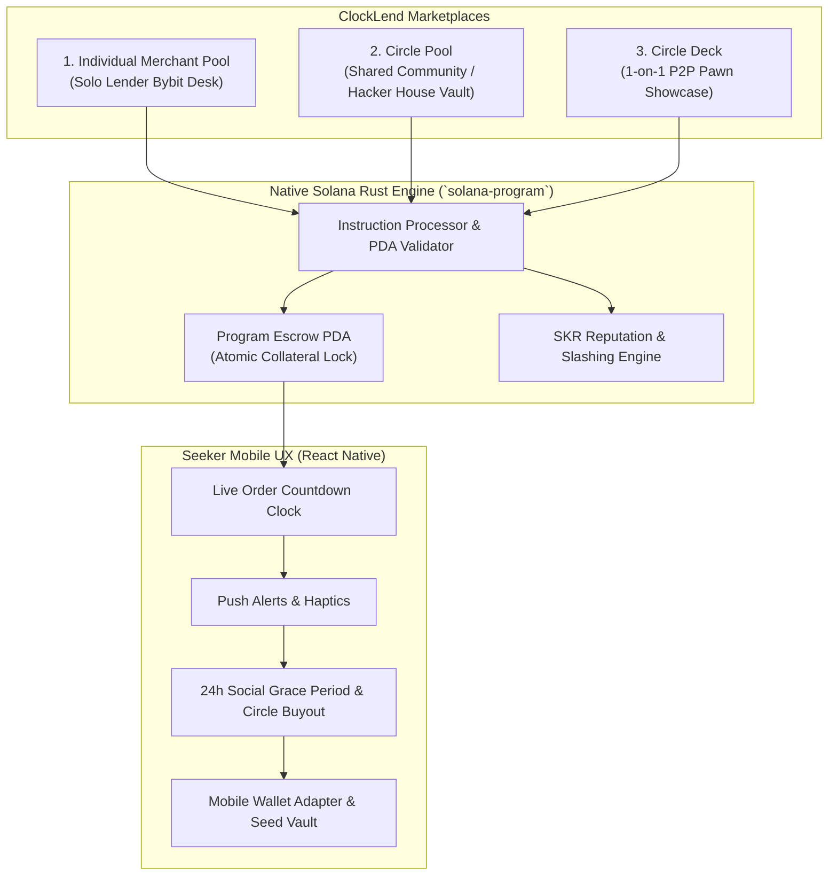

# 📱 ClockLend
### *The Bybit P2P for Micro-Lending & Social Pawns on Solana Seeker*
> **Built for the CLOCK IN Hackathon (Solana Mobile & RadiantsDAO)**  
> **Devnet Program ID:** [`HAjGxuih14imCMaWvCnJQ3nSdWmS8PQKzp74gyAgjsH3`](https://explorer.solana.com/address/HAjGxuih14imCMaWvCnJQ3nSdWmS8PQKzp74gyAgjsH3?cluster=devnet)

---

## 🌟 Overview

**ClockLend** brings the battle-tested, highly liquid mechanics of **Bybit P2P** to decentralized micro-lending on the **Solana Seeker** smartphone. 

Instead of impersonal DeFi lending protocols with punitive 150%+ overcollateralization and ruthless liquidation bots, ClockLend introduces:
1. **Bybit P2P Express (1-Tap Match)**: Instant borrowing against crypto assets and NFTs routed to the cheapest verified lending pool.
2. **Merchant Desks & Circle Pools**: Solo lenders or community groups (hacker houses, DAOs) deploy capital into escrowed lending desks with customized risk rules.
3. **Circle Pawn Deck**: 1-on-1 social pawn loans allowing users to lock exotic NFTs, cNFTs, and Seeker Genesis tokens for peer funding.
4. **Live Bybit Order Countdown Widget**: Prominent ticking clock on the mobile dashboard showing exact time remaining before loan settlement.
5. **The Social Safety Net (24h Grace Period)**: When a loan is at risk, a 24-hour social grace period triggers, giving circle members priority buyout rights before any external bot can liquidate.
6. **SKR Reputation Bond ($10,000 Hackathon Track)**: Staking SKR unlocks **90% LTV**, grants up to **50% APR fee discounts**, and serves as a slashable default guarantee.

---

## 🏗️ Architecture



---

## 🚀 Live On-Chain Deployment (Solana Devnet)

* **Program ID**: `HAjGxuih14imCMaWvCnJQ3nSdWmS8PQKzp74gyAgjsH3`
* **ProgramData Address**: `76MvPRVKdsthzyBQhFnfqgd7QtjebiAGCLNTA56nCgMB`
* **Upgrade Authority**: `BEmX1nfeZT5i4VpSEeZmhiYxpZ9z4Y1LQLjAtPR9c3re`
* **Deployment Transaction**: `4pRHXTtHP6XfBQ79u8RAPoCrXMEkUiV486s8J7zS7B6HRKcqVwb5FgPaxrz2FeChusWs89Dbg44RgAAjQWDBCY1Q`
* **Bytecode Size**: 150,576 bytes (Optimized Native Rust SBF)

---

## 🛡️ Smart Contract Security & Audit

The on-chain core is built in **Native Solana Rust (`solana-program`)** with Borsh serialization, completely macro-free for maximum compute-unit efficiency.

### Security Defenses:
* **Account Owner Verification (`assert_owned_by`)**: Prevents fake external account injection.
* **Repayment Destination Verification**: Cryptographically enforces that loan repayments only transfer to the verified pool vault or P2P funder.
* **Escrow PDA Tamper Resistance**: Program-derived address validation prevents uncollateralized borrow exploits.
* **LTV Bounds**: Strict contract-level enforcement: `borrow_amount <= (collateral_amount * pool.max_ltv_bps) / 10000`.
* **Checks-Effects-Interactions**: All loan state flags are updated *before* CPI token transfers to eliminate re-entrancy risks.
* **Deterministic Integer Slashing**: Pure integer arithmetic (`staked_skr.saturating_mul(80) / 100`) eliminating SBF float hazards.

### Automated Test Suite (13/13 Passing):
```bash
$ cd program && cargo test
test test_id ... ok
test test_bank_initialize_pool_rejects_unauthorized_signer ... ok
test test_bank_initialize_pool_success ... ok
test test_security_grace_period_timing ... ok
test test_security_interest_calculation ... ok
test test_security_ltv_enforcement ... ok
test test_security_pda_seeds_tamper_resistance ... ok
test test_security_slashing_deterministic_math ... ok
test test_instruction_serialization ... ok
test test_lending_pool_serialization ... ok
test test_loan_order_serialization ... ok
test test_p2p_offer_serialization ... ok
test test_user_profile_serialization ... ok

test result: ok. 13 passed; 0 failed; 0 warnings
```

---

## 📱 Mobile App (Seeker Native)

Located in `/mobile`, the application features a Bybit P2P dark theme optimized for the Solana Seeker device:

### Key Tabs:
1. **⚡ Express**: 1-tap instant borrowing with real-time collateral calculators and lowest-APR routing.
2. **🏪 Desks**: Filter and browse Solo Merchant credit desks and Community Circles. Includes **NFC Phone Bump** simulation to join circles in person.
3. **🃏 Pawn Deck**: 1-on-1 social pawn listings for cNFTs, NFTs, and tokens with peer funding actions.
4. **⏱️ Orders**: Live ticking Bybit countdown clock, collateral health indicators, 1-swipe repayment, and 24h Social Grace activation.
5. **👤 Profile**: Soulbound on-chain credit score (`99.6% (18/18 repaid)`), SKR staking & bonding desk, and Solana Explorer links.

### How to Run:
```bash
cd mobile
npm start
# To launch on connected Seeker / Android device:
npm run android
```

---

## 🏆 Hackathon Alignment

| Hackathon Requirement | How ClockLend Delivers |
| :--- | :--- |
| **Mobile-First UX** | Ticking countdown widget, NFC phone bump, haptics, Seed Vault MWA 1-tap signing. |
| **$10,000 SKR Track** | Deep economic utility: SKR is staked for merchant ranking, unlocks 90% LTV, slashes on default, and grants 50% APR fee discounts. |
| **Functional Android APK** | Built with local Android SDK and Gradle into a standalone `.apk`. |
| **Defensible Narrative** | P2P and informal credit (ROSCAs, chit funds) move hundreds of billions globally. ClockLend brings this to Web3 mobile with smart contract collateral security. |
