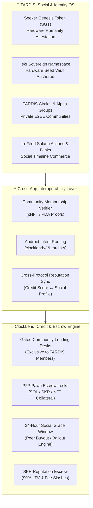

# 🌌 ClockLend & TARDIS: Ecosystem Synergy & Integration Blueprint
### *Unifying Social Identity & Micro-Finance for Solana Seeker*

---

## 📖 Executive Summary

**ClockLend** (Decentralized P2P Micro-Lending & Social Pawns) and **TARDIS** (The Social-Financial OS for Solana Seeker) form a symbiotic super-app ecosystem on the **Solana Mobile Stack**.

While **TARDIS** establishes the hardware-attested, bot-free social moat with sovereign `.skr` identities, encrypted feeds, and community groups, **ClockLend** provides the non-custodial financial rail, atomic collateral escrows (SOL, SKR, NFTs), and peer credit desks. 

By linking both protocols, TARDIS communities gain instant, native credit and micro-banking capabilities, while ClockLend inherits a Sybil-resistant, trusted social graph with zero bot manipulation.

---

## 🏛️ Architectural Overview

---

## 🔐 1. Gated Lending Circles: Exclusive TARDIS Communities

A core requirement of the integration is that **Circle Pools can only be joined through the TARDIS community**, ensuring strict social trust and zero anonymous capital extraction.

### How It Works:
1. **Community Binding**: Every TARDIS community group possesses a cryptographic identifier (Group PDA or Community Attestation Mint). When a community admin establishes a Lending Desk in ClockLend, the desk is cryptographically bound to that `TardisCommunityID`.
2. **Access Verification Gate**:
   - When any borrower or lender attempts to access, deposit into, or borrow from a TARDIS Circle Desk, ClockLend verifies that the connected Seeker wallet holds the corresponding TARDIS community membership credential.
   - **Authorized Members**: Instant access to preferential interest rates, higher LTV ratios, and peer liquidity.
   - **Non-Members**: The desk displays a secure lock:
     > *"🔒 Private TARDIS Circle: This desk is restricted to members of the [Community Name] TARDIS group. Open TARDIS to join the community and unlock access."*
3. **In-Group Deep Linking**:
   - Inside TARDIS group settings, community leaders can tap **"Open Lending Desk"** to trigger `clocklend://circle/{community_id}`, launching ClockLend directly into their authenticated community vault.

---

## ⚡ 2. In-Feed Micro-Lending via Solana Blinks & Actions

TARDIS provides an interactive feed powered by **Solana Actions & Blinks**. ClockLend leverages this to bring credit directly into the conversation:

1. **Instant Loan Cards in Chat & Feed**:
   - When a ClockLend user creates a P2P pawn request (e.g. *Borrow 50 USDC against 0.5 SOL for 7 days*) or launches a community pool, they can tap **"Share to TARDIS"**.
   - ClockLend compiles the request into an interactive Solana Action (Blink).
2. **1-Click Funding Inside TARDIS**:
   - The listing renders as a native, live ClockLend Blink card inside the TARDIS group timeline.
   - Fellow community members can review terms, check collateral health, and tap **"Fund Loan"** directly inside TARDIS. The transaction signs through the Seeker Seed Vault without leaving the chat app.

---

## 🛡️ 3. Cross-App Reputation & Identity Sync

Both protocols share the **Solana Seeker Seed Vault** and `.skr` handle infrastructure:

1. **Reputation Badging in TARDIS**:
   - When users repay loans on time and stake SKR reputation bonds in ClockLend, their credit standing (`Standard`, `Silver`, `Gold`, `Diamond`) synchronizes with their TARDIS social profile.
   - A user displaying a **"Diamond ClockLend Underwriter"** badge carries instant prestige, social credit, and counterparty trust across all TARDIS social features.
2. **Social Capital as Collateral**:
   - Members with longstanding tenure, high social karma, and zero dispute flags in TARDIS automatically qualify for fee discounts and up to **90% LTV** within ClockLend desks.

---

## 🤝 4. Social Grace & Peer Rescue via TARDIS DMs

ClockLend replaces predatory liquidation bots with a human-centric **24-Hour Social Grace Period**:

1. **Automated Grace Alerts**:
   - When a loan approaches default, ClockLend triggers an on-chain grace period and dispatches an encrypted notification into the borrower's private TARDIS circle.
2. **Peer Buyout & Community Bailouts**:
   - Circle peers in TARDIS receive the prompt:
     > *"⚠️ Your peer @handle has entered their 24h grace window. Tap below to buy out their loan and keep the collateral locked inside your trusted community."*
3. **Internal Resolution**:
   - A circle peer can step in, cover the outstanding balance, and claim or hold the collateral until their friend recovers—preventing cold algorithmic liquidation and building collective community wealth.

---

## 📱 5. Mobile Composability & Deep Link Schemas

| Trigger Location | User Action | Deep Link URI | Target App Destination |
| :--- | :--- | :--- | :--- |
| **TARDIS Group** | Tap "Community Desk" | `clocklend://circle/{id}` | Opens ClockLend directly into the private community lending vault. |
| **ClockLend Order** | Tap "Message Counterparty" | `tardis://dm/{skr_handle}` | Opens an encrypted, zero-knowledge DM in TARDIS with the borrower/lender. |
| **ClockLend Grace** | Tap "Ask Circle for Help" | `tardis://group/{id}/grace` | Opens TARDIS group chat with pre-formatted loan buyout terms. |

---

## 🏆 Strategic Advantage for the Solana Seeker dApp Store

Integrating **ClockLend** and **TARDIS** represents a landmark showcase of **mobile-native Solana architecture**:

1. **Hardware-Anchored Security**: Seed Vault key protection and Seeker Genesis Token verification eliminate bots, Sybils, and fake liquidity.
2. **Network Effects**: TARDIS's existing user base immediately fuels ClockLend's liquidity, while ClockLend provides TARDIS with real financial utility beyond messaging.
3. **Solana dApp Store Precedent**: Delivers a cohesive, interoperable OS-level user experience that sets a new benchmark for Web3 mobile design.
